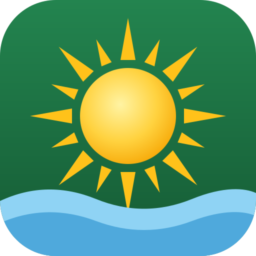

<p align="center"></p>

# Värmlandsinfo

En liten webbapp i Docker som visar en översikt över **aktuella evenemang i Värmland** i datumordning,
med en **AI-chatt** (via Ollama) där du kan ställa frågor om evenemangen.

Evenemangen hämtas från flera källor och slås ihop. Samma evenemang från flera källor visas en gång,
med länkar till alla källor.

| Källa | Hur | Vad |
|-------|-----|-----|
| [Visit Värmland](https://visitvarmland.com/evenemang) | Öppet API (Turid v8) | Evenemang i hela Värmland. Omfattar även Karlstads och Hammarö kommuns evenemangskalendrar, som visar ett urval ur samma API. |
| [Ticketmaster](https://www.ticketmaster.se) | Discovery API v2 (kräver API-nyckel) | Konserter, shower och sport på arenor i Värmland. |
| [Karlstad CCC](https://www.karlstadccc.se/17/38/program-biljetter/) | Kalendersidan (HTML) | Konserter och shower i Solasalen. |
| [Scalateatern](https://www.scalateatern.se/forestallningar/) | Föreställningslistan (HTML) | Teater, musik och humor på Scalateaterns scener. |
| [SHL](https://www.shl.se/game-schedule) | Öppet spelschema-API | Färjestad BK:s hemmamatcher (laget går att byta med `SHL_TEAM_CODE`). |

CCC och Scalateatern saknar API, så deras webbsidor läses. Ändras sidornas struktur och inga evenemang
hittas, behålls senast sparade data och felet visas i menyn, på sidan *Om applikationen* och i `/api/health`.

## Funktioner

- **Evenemangslista:** alla kommande och pågående evenemang, grupperade per dag (Idag, Imorgon …).
- **Evenemangstyp:** kategori med ikon, färg och en kort beskrivning av typen.
- **Detaljer:** sammanfattning, längre beskrivning, plats (med länk till Google Maps) och arrangör.
- **Länkar:** till evenemanget på visitvarmland.com, samt biljett- och webbplatslänk när sådana finns.
- **Bilder:** från evenemanget (klicka för att förstora).
- **Kalendervy:** växla mellan *Lista* och *Kalender*. Kalendern visar en månad med en vecka per rad
  (mån–sön, med veckonummer) och evenemangen färgkodade per typ. Klicka på en dag för att se alla
  dagens evenemang med bilder och länkar.
- **Källor:** varje evenemang visar sina källor och har länkar till dem. Det finns ett filter per källa.
- **Filter:** fritextsök, kategori, kommun, källa och datumintervall, samt "Visa varje tillfälle"
  för evenemang som återkommer flera gånger.
- **Modernt gränssnitt:** en sidomeny med Evenemang, Kalender, Fråga AI och Om applikationen samt källornas status.
  Varje vy har en egen adress (`#/lista`, `#/kalender`, `#/fraga`, `#/om`). På datorn kan menyn fällas ihop
  till en smal list med ikoner. På mobil fälls menyn ut.
- **Gratis:** evenemang med fri entré får kategorin *Gratis* och kan filtreras fram. Ett evenemang räknas
  bara som gratis om källan anger fri entré eller pris 0 och inget pris över 0 finns.
- **Datumval:** Idag, Imorgon, I helgen, Den här veckan, Nästa vecka, Den här månaden, Nästa månad eller egna datum.
- **AI-chatt:** sidan *Fråga AI* har förslagskort och snabbval och är kopplad till din egen Ollama. Ställ frågor som
  "Vad händer i Karlstad i helgen?" eller "Finns det barnaktiviteter nästa vecka?". Svaren strömmas,
  länkar till evenemangen och visar vilket underlag de bygger på. Följdfrågor som "och på söndag då?"
  fungerar också. Modellen körs lokalt, och sidan informerar om att svaren därför kan ta längre tid än hos
  molntjänster som ChatGPT och Gemini. Svar sparas: samma fråga samma dag, mot samma evenemangsdata, besvaras
  direkt utan en ny förfrågan till AI:n. Alla fördefinierade frågor sparas, liksom de 10 senaste egna.
  Enkla sökfrågor ("När spelar Färjestad nästa gång?") besvaras direkt av appen utan AI.
- **Ljust och mörkt läge:** sidan följer webbläsarens tema och all text klarar WCAG AA i båda lägena.
- **Om applikationen:** en sida som beskriver funktionerna och visar källornas status och versionen.
- **Version:** versionen syns i menyn och länkar till releasen på GitHub.
- **Uppdatering:** evenemangen hämtas automatiskt en gång per dygn (standard 05:00). Vill du uppdatera
  direkt anropar du `POST /api/refresh`, till exempel `curl -X POST http://localhost:7799/api/refresh`.
- **Lagring:** allt som hämtas sparas i `./data` på värden. Vid omstart visas evenemangen direkt,
  utan att API:et anropas i onödan.

## Ikon

Appens ikon är en sol över en våg, inspirerad av Karlstad, "Solstaden", och Vänern. Det är en egen
design och ingen kopia av Karlstads kommuns logotyp. Källfilen är `app/static/icons/icon.svg`. PNG-filerna
(favicon, Apple touch-ikon och webbappikoner) är renderade från den. Appen kan läggas till på
hemskärmen i mobilen.

## Kom igång

Kräver Docker med Compose-pluginet.

```bash
git clone https://github.com/tubalainen/varmlandsinfo.git
cd varmlandsinfo
cp .env.example .env      # justera inställningarna, t.ex. OLLAMA_URL
docker compose pull       # hämtar imagen från ghcr.io
docker compose up -d
```

Öppna sedan <http://localhost:7799>.

Vill du bygga imagen själv i stället: `docker compose up -d --build`.

Första hämtningen tar ungefär 10–30 sekunder, eftersom API:et ger max 50 evenemang per sida.
Därefter sparas datan och laddas direkt vid omstart.

### Köra en viss version

Sätt `VARMLANDSINFO_TAG` i `.env`, till exempel `VARMLANDSINFO_TAG=0.0.1`, och kör
`docker compose pull && docker compose up -d`. `latest` pekar alltid på senaste release.

## Inställningar

Alla inställningar görs i `.env`, som docker compose läser automatiskt. Utgå från `.env.example`.
`.env` checkas aldrig in i git, så privata adresser stannar lokalt.

| Variabel             | Standard           | Beskrivning |
|----------------------|--------------------|-------------|
| `VARMLANDSINFO_PORT` | `7799`             | Port på värdmaskinen. |
| `VARMLANDSINFO_TAG`  | `latest`           | Imagetagg från ghcr.io (`latest` eller en version, t.ex. `0.0.1`). |
| `TICKETMASTER_API_KEY` | *(tom)*          | API-nyckel för Ticketmaster. Tom betyder att källan är avstängd. |
| `TICKETMASTER_RADIUS_KM` | `150`          | Sökradie kring Värmland (km). |
| `SHL_TEAM_CODE`      | `FBK`              | Lag vars hemmamatcher hämtas från SHL. |
| `OLLAMA_URL`         | *(tom)*            | Adress till Ollama. Tom betyder att AI-chatten är avstängd. |
| `OLLAMA_MODEL`       | `llama3.1:8b`      | Modell i Ollama. |
| `OLLAMA_NUM_CTX`     | `16384`            | Kontextfönster (tokens) för modellen. |
| `CHAT_MAX_EVENTS`    | `40`               | Max antal evenemang som skickas med till modellen per fråga. |
| `DAILY_REFRESH_TIME` | `05:00`            | Tidpunkt för den dagliga uppdateringen. |
| `REFRESH_MINUTES`    | `0`                | Extra uppdatering var N:e minut (0 = av, minst 30). |
| `VARMLANDSINFO_DATA` | `./data`           | Katalog på värden där hämtad data sparas. |
| `PUID` / `PGID`      | `1000` / `1000`    | Användare och grupp som äger filerna i datakatalogen. |
| `TZ`                 | `Europe/Stockholm` | Tidszon, avgör bland annat vad som räknas som "idag". |

## Hur källorna anropas

Alla källor hämtas tillsammans en gång per dygn (`DAILY_REFRESH_TIME`). En normal dag blir det ungefär:

| Källa | Anrop | Kommentar |
|-------|-------|-----------|
| Visit Värmland | cirka 15 | Max 50 evenemang per sida. Kommunlistan hämtas en gång i veckan. Gräns: 60 anrop/minut. |
| Ticketmaster | 1–5 | 200 evenemang per sida. Gräns: 5 anrop/sekund, 5000 per dygn. |
| Karlstad CCC | 1 | En kalendersida. |
| Scalateatern | cirka 5 | En sida per 25 föreställningar, med paus mellan sidorna (högst 15 sidor). |
| SHL | 2 | Säsongsfilter och spelschema. |

Skydden gäller alla källor:

- **Vid start** används sparad data, och bara källor vars data är inaktuell hämtas.
- **`POST /api/refresh`** hämtar inte om datan är yngre än 5 minuter.
- **`REFRESH_MINUTES`** kan inte sättas tätare än 30 minuter.
- **Om en källa svarar `429 Too Many Requests`** väntar appen enligt `Retry-After`. Är kvoten nästan
  slut pausar hämtningen.
- **Om en källa fallerar** behålls dess senast sparade data. Bara den källan försöks igen efter 30 minuter.
- **Anrop:** antalet anrop sedan start syns som `api_calls` i `/api/health`, och status per källa under `sources`.
- **API-nycklar** loggas aldrig och syns aldrig i felmeddelanden.

## Lagring av data

Allt som hämtas från Visit Värmlands API sparas på värden i katalogen `./data` bredvid
`docker-compose.yaml`. Katalogen monteras som volym till `/data` i containern och skapas automatiskt.

| Fil                        | Innehåll |
|----------------------------|----------|
| `data/visitvarmland.json`  | Rådata från Visit Värmland (evenemang och kommuner). |
| `data/ticketmaster.json`   | Rådata från Ticketmaster (evenemang i Värmland). |
| `data/ccc.json`            | Karlstad CCC:s kalendersida. |
| `data/scala.json`          | Scalateaterns föreställningslistor. |
| `data/shl.json`            | Lagets hemmamatcher från SHL. |
| `data/chat_cache.json`     | Sparade AI-svar (fördefinierade frågor och de 10 senaste egna frågorna). |

- **Vid start** läses filerna in och evenemangen visas direkt. En källa anropas bara om dess data är
  äldre än den senaste schemalagda uppdateringen, till exempel om containern varit avstängd över natten.
- **Vid uppdatering** skrivs filen atomärt (först till en temporär fil som sedan byter namn), så att
  en krasch inte lämnar en trasig fil.
- **Om en hämtning misslyckas** behålls senast sparade data.
- Eftersom rådata sparas kan en ny version av appen tolka om den utan att hämta allt på nytt.
- Filerna ägs av användaren `PUID`/`PGID` (standard 1000). Kör `id` på värden för att se dina värden
  och sätt dem i `.env`.
- Vill du lägga datan någon annanstans sätter du `VARMLANDSINFO_DATA`, till exempel `/srv/varmlandsinfo`.
- Radera en fil för att tvinga fram en ny hämtning av den källan vid nästa start.

## AI-chatt med Ollama

1. Installera [Ollama](https://ollama.com) och hämta en modell, till exempel:
   ```bash
   ollama pull llama3.1:8b
   ```
   Modeller som är bra på svenska ger bättre svar, till exempel `qwen2.5:7b`, `gemma3:12b` eller `llama3.1:8b`.
2. Ange adressen i `.env`:
   - Ollama på samma maskin som Docker: `OLLAMA_URL=http://host.docker.internal:11434`
   - Ollama på en annan dator i nätverket: `OLLAMA_URL=http://<ip-adress>:11434`

   Basadressen räcker, men en fullständig endpoint som `http://<ip-adress>:11434/v1/chat/completions`
   fungerar också.
3. Om Ollama körs på en annan dator måste den lyssna på nätverket och inte bara på `localhost`.
   Sätt `OLLAMA_HOST=0.0.0.0` i Ollamas miljö.
4. Starta om: `docker compose up -d`. Sidan *Fråga AI* visar vilken modell som används och
   varnar om Ollama inte går att nå eller om modellen saknas.

**Säkerhet och avgränsning:** AI:n svarar bara på frågor om evenemang och aktiviteter i appen.
- Frågor om annat, som dikter, kod eller allmänna kunskapsfrågor, får ett fast svar som bestäms av servern.
  Modellen markerar sådana frågor, och servern ersätter markören innan något visas.
- Uppenbara försök att ändra AI:ns uppdrag ("ignorera dina instruktioner …") stoppas direkt, utan att modellen
  tillfrågas.
- Evenemangstexterna från källorna skickas som avgränsad data och kan inte ge modellen nya instruktioner.
- Frågor får vara högst 1000 tecken.

**Flera samtidiga användare:** varje webbläsarflik har ett eget samtal (session). Servern äger historiken.
- Fliken får ett slumpat sessions-id av servern och sparar det i `sessionStorage`. Klienten skickar bara sin nya
  fråga, så historiken kan inte förfalskas.
- Samtalet finns kvar när sidan laddas om. En ny flik ger ett nytt samtal, och *Nytt samtal* rensar samtalet på
  servern.
- Samtal som inte används på 2 timmar tas bort. Samtalen finns bara i minnet och försvinner vid omstart.
- Varje samtal ställer en fråga i taget och högst 10 frågor per minut.
- Högst 2 frågor körs samtidigt mot Ollama. Övriga väntar i en rättvis kö (först till kvarn, högst 10 i kö), och
  den som väntar ser sin plats i kön. Enkla sökfrågor och sparade svar går förbi kön.
- Sparade AI-svar delas mellan alla användare.

**Direktsökning eller AI:** alla frågor behöver inte AI. Frågor som bara letar efter evenemang, som
"När spelar Färjestad nästa gång?", "Vad händer idag?" eller "Vilka konserter finns i Karlstad i oktober?",
besvaras direkt av appen: den söker bland evenemangen och listar träffarna i datumordning, med nästa tillfälle
först för när-frågor. Det går på ett ögonblick och fungerar även utan Ollama. AI:n används när frågan kräver en
bedömning, till exempel rekommendationer, jämförelser, personliga önskemål ("min son", "vi") eller långa frågor.

**Rekommendationer:** komplexa frågor fungerar, till exempel "Vilka aktiviteter skulle passa för min 8 år gamla
son i Karlstad nu till helgen?". Ålder och ord som son, dotter och familj tolkas som barn, så barn- och
familjeevenemang prioriteras. AI:n väljer ut 3–5 förslag och motiverar varför de passar.

**Så fungerar det:** appen skickar inte alla evenemang till modellen. För varje fråga tolkar den
tidsuttryck (idag, i helgen, nästa vecka, 3 oktober, i oktober …), kommuner, evenemangstyper och
sökord. Utifrån det väljer den ut de mest relevanta evenemangen (högst `CHAT_MAX_EVENTS`) och
skickar dem som underlag. Modellen instrueras att bara svara utifrån underlaget.

## API

| Metod | Sökväg             | Beskrivning |
|-------|--------------------|-------------|
| GET   | `/api/events`      | Alla aktuella evenemang i JSON, sorterade på nästa tillfälle. |
| GET   | `/api/health`      | Version, antal evenemang, status per källa, senaste och nästa uppdatering, lagringsstatus. |
| POST  | `/api/refresh`     | Hämtar alla evenemang på nytt och svarar när det är klart. |
| GET   | `/api/chat/presets` | De fördefinierade frågorna i Fråga AI. |
| GET   | `/api/chat/status` | Om AI-chatten är konfigurerad och om Ollama går att nå. |
| POST  | `/api/chat`        | Ny fråga: `{"question": "…"}` med sessions-id i huvudet `X-Chat-Session`. Svaret strömmas som NDJSON och börjar med `{"type": "session", "id": …}`. 409 om en fråga redan pågår, 429 vid för många frågor. |
| GET   | `/api/chat/session` | Samtalet för sessionen i `X-Chat-Session`. |
| DELETE | `/api/chat/session` | Nytt samtal: tar bort sessionens historik. |

## Versioner och releaser

Projektet använder semantisk versionering. Versionen står i `app/version.py`. Den visas i menyn
(som länk till releasen på GitHub), i `/api/health` och överst i loggen när containern startar:

```
$ docker logs varmlandsinfo
... INFO ============================================================
... INFO   Värmlandsinfo v0.1.0
... INFO   Release: https://github.com/tubalainen/varmlandsinfo/releases/tag/v0.1.0
... INFO   Källkod: https://github.com/tubalainen/varmlandsinfo
```

Ändringar listas i [CHANGELOG.md](CHANGELOG.md), och releaserna finns under
[Releases](https://github.com/tubalainen/varmlandsinfo/releases).

- Ändringar committas direkt på `main`, kopplade till issues. Ingen image publiceras då.
- En release görs på begäran och kan innehålla flera ändringar. Då skapas en GitHub-release och
  imagen `ghcr.io/tubalainen/varmlandsinfo:X.Y.Z` (samt `X.Y` och `latest`) för `linux/amd64` och `linux/arm64`.

Hela arbetsflödet beskrivs i [CONTRIBUTING.md](CONTRIBUTING.md).

Paketet på ghcr.io blir privat första gången det publiceras. Gör det publikt under
*GitHub → Packages → varmlandsinfo → Package settings → Change visibility*,
eller logga in med `docker login ghcr.io` innan du kör `docker compose pull`.

## Projektstruktur

```
app/
  main.py          FastAPI-server, API och schemaläggning
  events.py        Hämtning, lagring och sammanslagning av alla källor
  sources/         En modul per källa (visitvarmland, ticketmaster, ccc, scala, shl)
  merge.py         Sammanslagning av samma evenemang från flera källor
  common.py        Gemensamma hjälpfunktioner (HTTP med rate limit, textrensning)
  chat.py          AI-chatt: urval av evenemang, kö och anrop till Ollama
  chat_cache.py    Sparade AI-svar
  sessions.py      Samtal (sessioner) i Fråga AI
  categories.py    Klassificering och beskrivning av evenemangstyper
  version.py       Versionsnummer
  static/          Webbgränssnittet (HTML/CSS/JS)
  static/icons/    Appens ikon (SVG och PNG i flera storlekar)
tests/             Tester (pytest)
tools/             Kontrastkontroll av gränssnittet i ljust och mörkt läge
.github/workflows/ CI, Docker-publicering och releaser
Dockerfile
docker-entrypoint.sh  Ger /data rätt ägare och startar appen som PUID:PGID
docker-compose.yaml
.env.example
data/                 Sparad data (skapas vid körning, ingår inte i git)
```
