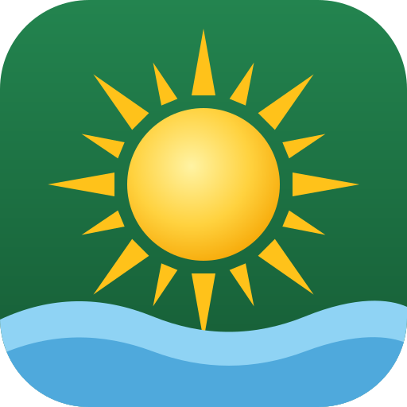
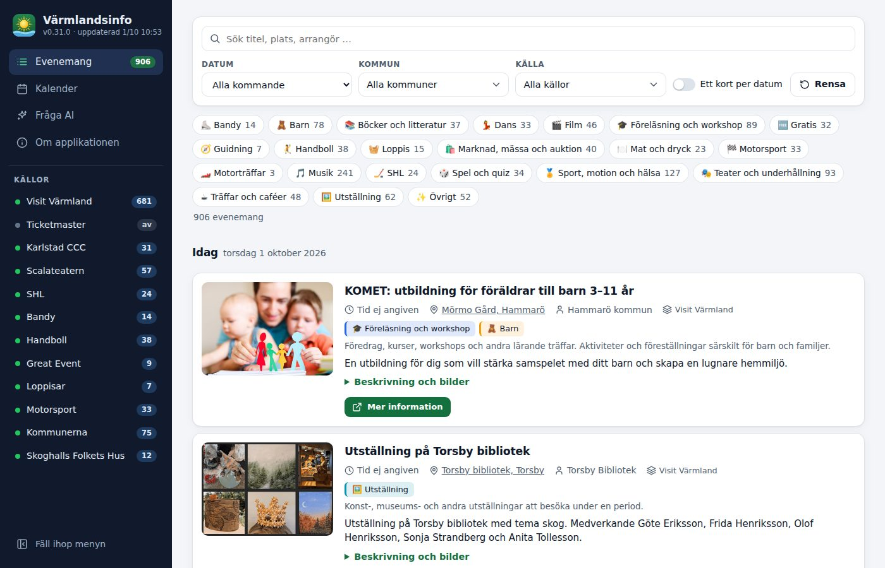
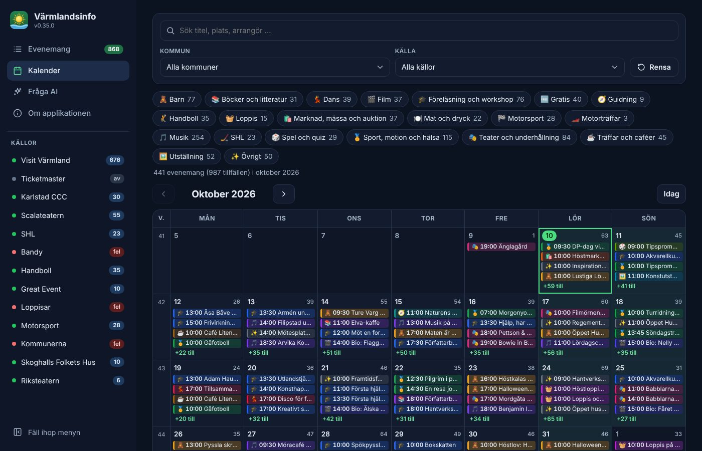
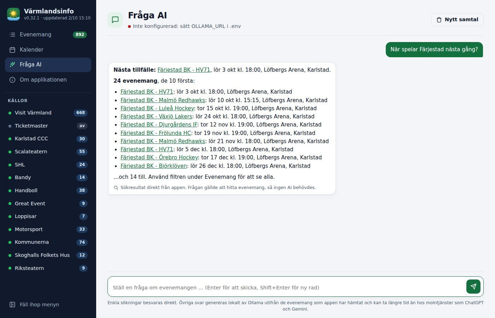
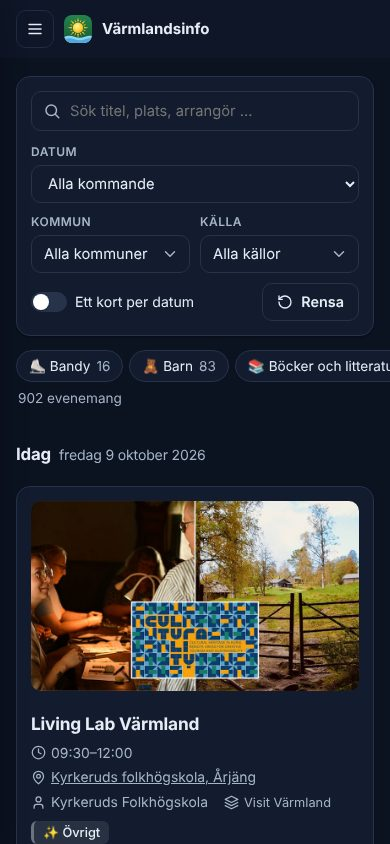
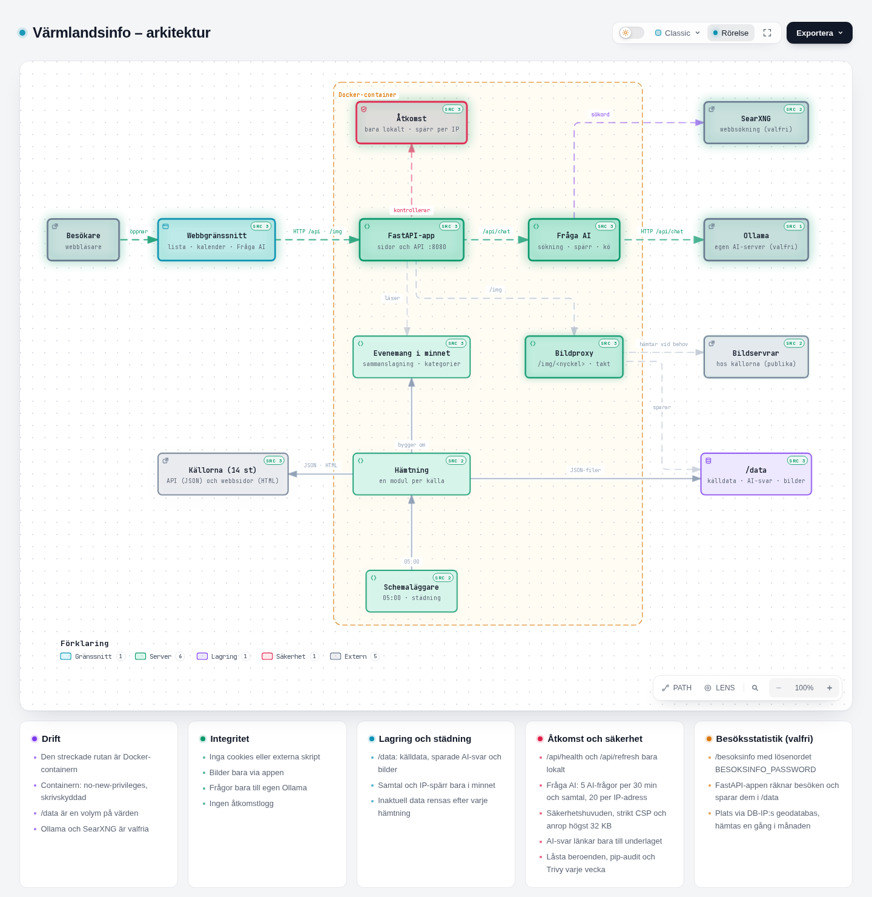

<p align="center"></p>

# Värmlandsinfo

En webbapp i Docker som samlar **aktuella evenemang i Värmland** från flera källor på ett ställe: som lista, i en
kalender och via **Fråga AI**, en chatt som svarar med hjälp av din egen Ollama. Öppen källkod under
[MIT-licensen](LICENSE).



| Kalendern (mörkt läge) | Fråga AI | Mobil (mörkt läge) |
|------------------------|----------|--------------------|
|  |  |  |

## Arkitektur

[](https://tubalainen.github.io/varmlandsinfo/arkitektur/varmlandsinfo.html)

Webbläsaren hämtar allt från en FastAPI-app i Docker (den streckade rutan). Appen hämtar evenemangen från källorna varje morgon, sparar
dem i `/data` och håller dem sammanslagna i minnet. Fråga AI använder din egen Ollama och valfritt SearXNG, och
bilderna hämtas via appen så att källorna aldrig ser besökarna.

Klicka på bilden för den interaktiva, animerade översikten, eller ändra
[Archify-specifikationen](docs/arkitektur/varmlandsinfo.architecture.json). Mer i [Arkitektur](docs/arkitektur.md).

## Funktioner

- **Evenemang från femton källor**, sammanslagna så att samma evenemang visas en gång: Visit Värmland, Ticketmaster,
  Karlstad CCC, Scalateatern, SHL, Bandy (Svenska Bandyförbundets matcher i Profixio), Handboll (Svenska
  Handbollförbundets matcher i Profixio), Great Event, Loppisar (Karlstad Loppis och loppisar.com), Motorsport (SBF och
  Svemo), Kommunerna (Säffles och Kils evenemangskalendrar) och Skoghalls Folkets Hus (allt utom film).
- **Lista och kalender** dag för dag, med filter på kategori, kommun, källa och datum.
- **Fråga AI:** sökfrågor besvaras direkt, och frågor som kräver en bedömning besvaras av din egen Ollama.
  Valfri webbsökning via SearXNG.
- **Besöksstatistik (valfri):** unika besökare, varifrån de kommer, enheter och hänvisningar på en dold,
  lösenordsskyddad sida.
- **Integritet:** inga cookies eller spårningsskript, bilderna visas via appen, AI:n körs lokalt och inaktuell data
  rensas bort.
- **Ljust och mörkt läge**, fungerar på mobil.

## Kom igång

Kräver Docker med Compose-pluginet.

```bash
git clone https://github.com/tubalainen/varmlandsinfo.git
cd varmlandsinfo
cp .env.example .env      # justera inställningarna, t.ex. OLLAMA_URL
docker compose pull
docker compose up -d
```

Öppna <http://localhost:7799>. Evenemangen hämtas första gången vid start och sedan varje morgon kl. 05.00.

De viktigaste inställningarna i `.env`:

| Variabel | Beskrivning |
|----------|-------------|
| `CHAT_ENABLED` | `false` döljer Fråga AI helt (standard `true`). |
| `OLLAMA_URL` | Adress till din Ollama, t.ex. `http://host.docker.internal:11434`. Tom = Fråga AI svarar bara på sökfrågor. |
| `SEARXNG_URL` | Adress till SearXNG för webbsökning i Fråga AI. Tom = av. |
| `TICKETMASTER_API_KEY` | API-nyckel för Ticketmaster. Tom = källan är av. |
| `BESOKSINFO_PASSWORD` | Lösenord till besöksstatistiken på `/besoksinfo`. Tom = ingen statistik. |
| `VARMLANDSINFO_PORT` | Port på värden (standard `7799`). |

Alla inställningar och hur Ollama och SearXNG sätts upp står i [Installation](docs/installation.md). Råd för att nå appen
från internet (t.ex. via Nginx Proxy Manager) finns i [Säkerhet](docs/sakerhet.md).

## Dokumentation

| | |
|---|---|
| [Arkitektur](docs/arkitektur.md) | Delarna i appen och hur de hänger ihop |
| [Installation och inställningar](docs/installation.md) | Docker, versioner, `.env`, Ollama, SearXNG |
| [Funktioner](docs/funktioner.md) | Lista, kalender, filter, kategorier |
| [Källor](docs/kallor.md) | Källorna och hur ofta de anropas |
| [Fråga AI](docs/fraga-ai.md) | Direktsökning, AI, avgränsning, spärrar, webbsökning |
| [Data och integritet](docs/data-och-integritet.md) | Lagring, städning, bilder via appen, cookies |
| [API](docs/api.md) | Adresserna och vem som får anropa dem |
| [Säkerhet](docs/sakerhet.md) | Säkerhetsanalysen och råd för drift |
| [Utveckling](docs/utveckling.md) | Projektstruktur, tester, releaser |

Ändringar per version: [CHANGELOG.md](CHANGELOG.md). Arbetsflöde: [CONTRIBUTING.md](CONTRIBUTING.md).

## Licens och ansvar

- **Licens:** öppen källkod under [MIT-licensen](LICENSE). Du får använda, kopiera, ändra och dela koden fritt, så
  länge licenstexten följer med.
- **Källornas innehåll:** appen gör inga anspråk på innehållet från källorna. Texter, bilder och uppgifter om
  evenemangen tillhör respektive källa och upphovsperson. Appen visar ett urval och länkar till källan för varje
  evenemang. Kontrollera alltid tider och andra uppgifter hos arrangören eller källan.
- **Inget ansvar:** appen levereras i befintligt skick, utan garantier av något slag. Inget som helst ansvar tas för
  appens funktion, för att uppgifterna stämmer eller är aktuella, för AI-chattens svar eller för följderna av att
  använda appen.

## Framtagen med Claude Code

Värmlandsinfo är framtagen med hjälp av [Claude Code](https://claude.com/claude-code), Anthropics AI-assistent för
programmering. Idéer, krav och beslut kommer från projektets ägare. Claude Code har skrivit det mesta av koden,
testerna och dokumentationen. Arbetssättet finns i [CLAUDE.md](CLAUDE.md).

Claude används bara för att utveckla appen. Fråga AI använder din egen Ollama, och inga frågor skickas till Claude
eller någon annan AI-tjänst i molnet.
