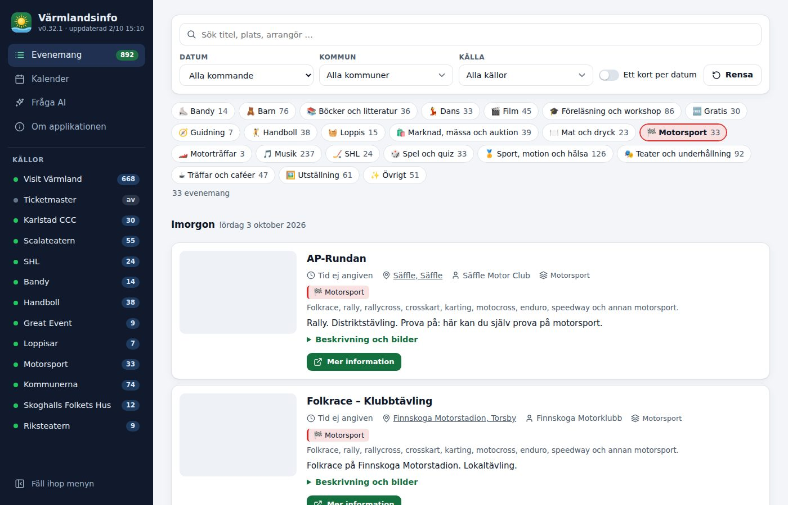

# Funktioner

## Evenemangslistan och kalendern

- **Evenemangslista:** alla kommande och pågående evenemang, grupperade per dag (Idag, Imorgon …).
- **Ordning:** under varje dag står först evenemangen som bara äger rum en dag, och sedan de som har flera datum,
  till exempel utställningar och återkommande evenemang. Inom varje grupp sorteras de på tid och titel. Samma
  ordning gäller i kalendern.
- **Kort per evenemang:** tid, plats (med länk till Google Maps), arrangör, typ, sammanfattning, längre beskrivning,
  bilder (klicka för att förstora) och länkar till evenemanget hos källan, biljetter och webbplats. Den längre
  beskrivningen visas i stycken: långa texter utan radbrytningar delas vid meningsgränser, webb- och e-postadresser
  blir länkar, och sammanfattningen döljs när beskrivningen är utfälld om beskrivningen börjar med samma text.
- **Återkommande evenemang** visas en gång, på första datumet, med övriga datum i kortet. Med reglaget
  *Ett kort per datum* visas de i stället som ett eget kort på varje datum.
- **Kalender:** en månad med en vecka per rad (mån–sön, med veckonummer) och evenemangen färgkodade per typ. Klicka
  på en dag för att se alla dagens evenemang med bilder och länkar.
- **Källor:** varje evenemang visar sina källor och har länkar till dem. Samma evenemang från flera källor visas en
  gång.

## Filter

- Fritextsök, kategori, kommun, källa och datum.
- Kommun och källa är flerval, så det går att välja flera samtidigt.
- **Datumval:** Idag, Imorgon, I helgen, Den här veckan, Nästa vecka, Den här månaden, Nästa månad eller egna datum.
- **Kategorifiltren** står i bokstavsordning, med antalet evenemang per kategori.

## Kategorier

Varje evenemang har en eller flera kategorier med ikon, färg och en kort beskrivning av typen. Källornas kategorier
används i första hand och kompletteras med regler:

- **Ordregler:** *Film* (bio, filmkvällar), *Spel och quiz* (bingo, quiz, korsord, brädspel, tipspromenader),
  *Träffar och caféer* (caféträffar, handarbete, språkcafé), *Böcker och litteratur* (bokcirklar, författarbesök,
  sagostunder) och *Musik* (konserter, gospel, körer) fångas ur titeln, och ur ingressen när källan inte angett
  någon egen typ.
- **Övrigt:** Visit Värmlands allmänna kategorier *Evenemang* och *Övriga evenemang* blir *Övrigt*, som bara visas
  när ingen annan kategori passar.
- **Loppis:** loppisar, loppmarknader och second hand har en egen kategori. Ett evenemang räknas som loppis om titeln
  nämner det, eller om det är en marknad vars ingress nämner loppis. En loppis behåller marknadskategorin
  (*Marknad, mässa och auktion*) bara om texten också nämner marknad, mässa eller auktion.
- **Motorsport:** tävlingar som folkrace, rally, rallycross, crosskart, karting, motocross, enduro och speedway har
  en egen kategori. Visit Värmlands kategori *Motor* heter *Motorträffar* i appen och gäller bil- och MC-träffar,
  veteranfordon och fordonsutställningar.
- **Gratis:** evenemang med fri entré. Ett evenemang räknas bara som gratis om källan anger fri entré eller pris 0
  och inget pris över 0 finns.

## Fråga AI

Ställ frågor på vanlig svenska, med förslagskort och snabbval. Enkla sökfrågor besvaras direkt av appen, och frågor
som kräver en bedömning av din egen Ollama. Se [Fråga AI](fraga-ai.md).

## Besöksstatistik (valfri)

Med ett lösenord i `BESOKSINFO_PASSWORD` visar den dolda sidan `/besoksinfo`:

- unika besökare och sidvisningar i dag och för en vald period (7, 30 eller 90 dagar eller ett år), med ett diagram per
  dag (per månad för ett år) och en tabell
- de vanligaste länderna, orterna, enheterna, webbläsarna, operativsystemen och hänvisningarna
- dagens besökare med IP-adress, tid, antal visningar, plats, enhet, webbläsare och hänvisning

Hur statistiken räknas och hur länge den sparas står i [Data och integritet](data-och-integritet.md#besöksstatistik).

## Gränssnittet

- **Meny:** Evenemang, Kalender, Fråga AI och Om applikationen samt källornas status. Varje vy har en egen adress
  (`#/lista`, `#/kalender`, `#/fraga`, `#/om`). På datorn kan menyn fällas ihop till en smal list med ikoner. På
  mobil fälls menyn ut.
- **Ljust och mörkt läge:** sidan följer webbläsarens tema, och all text klarar WCAG AA i båda lägena.
- **Om applikationen:** beskriver funktionerna och visar källornas status, versionen, licensen och vad som lagras.
- **Version:** versionen syns i menyn och länkar till releasen på GitHub.
- **Hemskärmen:** appen kan läggas till på hemskärmen i mobilen.

## Ikon

Appens ikon är en sol över en våg, inspirerad av Karlstad, "Solstaden", och Vänern. Det är en egen design och ingen
kopia av Karlstads kommuns logotyp. Källfilen är `app/static/icons/icon.svg`. PNG-filerna (favicon, Apple
touch-ikon och webbappikoner) är renderade från den.
